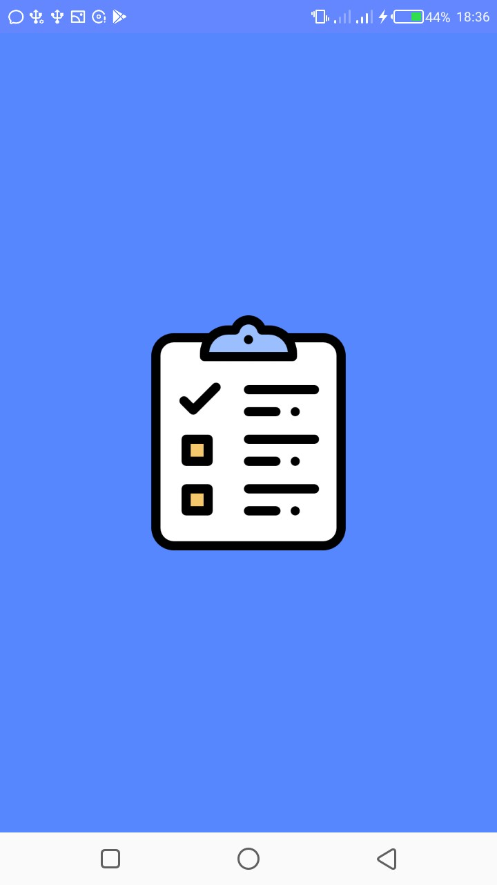

# todo-app-mvvm
I attended Android Nigeria's third meetup, and I met fantastic persons. It was amazing, and I was motivated. On the other hand, there were a lot of things discussed, many of which I have heard of in the past, but never really cared about. But after thr meetup, I took it upon myself to get myself up to date. The first on my list was learning the MVVM architecture pattern among other big guns like Retrofit, RxJava and MotionLayout. But I went for MVVM first.

# The App #
It is a Todo Application that contains the following features

**Categories:**
The app displays a list of categories for each todo item. They consist of *All*, *Work*, *Travel*, and many more..

**Todo Category Details**
This part of the app displays the items that are under a specific todo category.

**Add Todo**
This screen allows you to add a new todo under a specific category. Specify the time the todo elapses and some other details such as tags.

## Components ##
* Android Mobile Framework
* Java Programming Language
* MVVM Architecture
* Material Design
* Room - Object Relational Mapping Library

## Brief Explanation of the MVVM Architecture ##
There are lots of architectures to consider when building an android application, coming from the likes of MVC(put *what* you want, *where* you want it, *when* you want it), MVP and MVI(MVVM+). They all have their pros and cons. The MVVM pattern can be translated Model-View-ViewModel. 

*Model:* The model basically is the data used in your application. The objects in the app which are represented a=s entities. These objects are used to send data around the application and over networks. They are also ways of encapsulating(bundling) properties in an enclosed structure.
 
*View:* This is basically what the user sees, text, lists, images - what have you!!
 
*ViewModel:* This node of the architecture does one major thing: **Hold Data**. The ViewModel as the name implies *models* the data on the *view*. So say, the view displays a list of students, courses or any other type of data, this data would be kept in the ViewModel. One of the added advantages of making use of this approach is that the ViewModel survives configuration changes i.e screen rotations and locale modifications. The ViewModel being lifecycle-aware takes away the burden of overriding onSaveInstanceState and the onRestoreInstanceState callbacks. It holds the data during all of these events. The ViewModel can also be used to retrieve data from the app's internal databases like SQLite (Room), and maybe data over a network. For all of this, and more, I chose this approach.
 
 *Bonus: **(Room)** * - as stated earlier is an ORM (Object Relational Mapping Library), this means it takes our already created models(objects) and maps them into tables in the databases, and properties into columns on the tables. This helps with common tasks that we have to do which are 99% of the time error-prone(especially when you miss a comma, when creating that table). It assists in running queries on databases, and returns the appropriate data specified. It also handles transactions and more.
 
    
